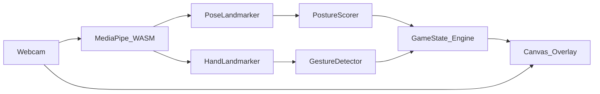

# PostureQuest: Body-as-Controller Wellness RPG

## Topic choice: Health & Wellness

**Why this topic:** MediaPipe's strongest browser APIs (Pose, Hands, Face) map directly to ergonomics, movement, and micro-breaks — making wellness feel like play instead of a chore.

**The wild idea:** You are not *playing* a character on screen — your skeleton *is* the character. Slouch at your desk and your in-game HP drops; sit tall and you charge mana. Raise a hand in a gesture and you cast a spell. Every 25 minutes, a "desk boss" appears and you defeat it by holding good posture + gesture combos for 60 seconds.



---

## Core gameplay loop

| Signal | MediaPipe source | Game effect |
|--------|------------------|-------------|
| Shoulder/hip alignment | Pose landmarks 11, 12, 23, 24 | HP regen when "aligned", drain when slouching |
| Forward head | Nose vs shoulder midpoint | "Neck strain" debuff, reduced mana regen |
| Open palm / fist / point / peace | Hand landmark geometry | Cast shield, smash, fireball, heal |
| Sustained good posture (30s) | Rolling posture average | Charge ultimate ability |

**Session flow:**
1. **Calibration (10s)** — user sits in their "good" posture; app records baseline shoulder angle + head position.
2. **Adventure mode** — ambient RPG overlay on mirrored webcam feed; skeleton avatar glows green/yellow/red.
3. **Boss break (every 25 min)** — fullscreen prompt: "Desk Dragon appears!" — survive 60s with posture above threshold + 3 gesture casts.
4. **Run summary** — HP timeline, posture %, spells cast, streak.

---

## Tech stack (greenfield — repo is empty)

| Layer | Choice | Rationale |
|-------|--------|-----------|
| App shell | **Vite + React + TypeScript** | Fast dev, easy canvas integration |
| Vision | **`@mediapipe/tasks-vision`** | Official WASM Pose + Hand landmarkers, runs fully in browser |
| Rendering | **HTML Canvas 2D** over `<video>` | Simple skeleton + sprite overlay; no WebGL needed for MVP |
| State | **React hooks + `useRef` game loop** | `requestAnimationFrame` for 30fps vision + render |
| Styling | **Tailwind CSS** | Quick polished UI for HUD, modals, boss screen |

No backend for MVP — all processing client-side (privacy-friendly selling point).

---

## Project structure

```
project/
├── index.html
├── package.json
├── vite.config.ts
├── src/
│   ├── main.tsx
│   ├── App.tsx
│   ├── components/
│   │   ├── CameraStage.tsx      # video + canvas stack
│   │   ├── GameHUD.tsx          # HP, mana, posture meter
│   │   ├── CalibrationModal.tsx
│   │   ├── BossOverlay.tsx
│   │   └── RunSummary.tsx
│   ├── vision/
│   │   ├── mediapipe.ts         # init Pose + Hand landmarkers
│   │   ├── posture.ts           # score 0–100 from landmarks
│   │   └── gestures.ts          # classify hand poses
│   ├── game/
│   │   ├── engine.ts            # HP/mana/boss timer logic
│   │   ├── renderer.ts          # draw skeleton avatar + effects
│   │   └── constants.ts
│   └── hooks/
│       └── useGameLoop.ts
```

---

## Key implementation details

### 1. MediaPipe setup ([`src/vision/mediapipe.ts`](src/vision/mediapipe.ts))

- Load `PoseLandmarker` + `HandLandmarker` from `@mediapipe/tasks-vision`
- Serve WASM/model assets from `@mediapipe/tasks-vision/wasm` via Vite `public/` or CDN fallback
- Call `detectForVideo(video, timestamp)` inside the game loop (not every frame — every 2nd frame is fine for perf)

### 2. Posture scoring ([`src/vision/posture.ts`](src/vision/posture.ts))

Compute from pose landmarks:
- **Shoulder tilt:** angle between shoulders (landmarks 11–12)
- **Forward lean:** horizontal offset of nose (0) from shoulder midpoint
- **Hip-shoulder stack:** vertical alignment of shoulder vs hip center

Score = weighted blend vs user's calibrated baseline. Thresholds:
- `>= 75` → good (HP regen)
- `40–74` → warning (neutral)
- `< 40` → slouch (HP drain −1/sec)

### 3. Gesture detection ([`src/vision/gestures.ts`](src/vision/gestures.ts))

Rule-based on finger extension (no ML model needed):
- **Open palm:** all fingers extended
- **Fist:** all fingers curled
- **Point:** index extended, others curled
- **Peace:** index + middle extended

Debounce 500ms to avoid spell spam.

### 4. Game engine ([`src/game/engine.ts`](src/game/engine.ts))

```typescript
// Conceptual state
{ hp: 100, mana: 0, postureScore, bossActive, bossTimer, spells: [] }
```

- HP drains at 1/sec when posture < 40 for 3+ consecutive seconds
- Mana fills when posture > 75 sustained
- Gestures consume mana and trigger canvas particle effects
- Boss mode: posture must stay > 60 for 60s; failure = funny "defeat" screen, retry

### 5. Canvas renderer ([`src/game/renderer.ts`](src/game/renderer.ts))

Draw on mirrored canvas (scale X −1 to match selfie view):
- Connect pose landmarks as glowing skeleton
- Color bones by posture score (green → yellow → red)
- Sprite "aura" around torso when casting
- Boss: simple animated dragon silhouette + HP bar

### 6. UI screens

- **Landing:** "Start Quest" + webcam permission
- **Calibration:** overlay guide silhouette, "Hold your best posture"
- **Game:** video + canvas + HUD (HP bar, posture meter, mana, mini-map timer to boss)
- **Boss:** dramatic overlay + countdown
- **Summary:** stats card (posture %, time in good posture, spells used)

---

## Wild polish (stretch goals, post-MVP)

- **Face Landmarker** — detect looking away from screen → "Distraction imp" steals mana
- **Sound design** — retro RPG SFX on spell cast / HP drain
- **Daily streak** — `localStorage` persistence
- **Co-op mode** — two browser tabs, compare posture scores (WebRTC data channel)

---

## Dependencies

```json
{
  "@mediapipe/tasks-vision": "^0.10.x",
  "react": "^19",
  "react-dom": "^19",
  "tailwindcss": "^4"
}
```

---

## Risks and mitigations

| Risk | Mitigation |
|------|------------|
| Webcam permission denied | Clear UX + static demo mode with prerecorded video |
| MediaPipe WASM load slow | Loading screen; preload models on app mount |
| False posture positives | 10s calibration baseline per user |
| Performance on weak laptops | Skip frames; reduce canvas resolution to 640×480 |

---

## Demo script (for presentation)

1. Open app → grant camera → calibrate posture
2. Slouch dramatically → HP drops, skeleton turns red, warning appears
3. Sit tall → HP recovers, mana charges
4. Cast fireball with point gesture → particle burst
5. Trigger boss fight → hold posture 60s → victory screen + stats

This is weird enough to stand out, technically grounded in MediaPipe, and demo-able live with a webcam in under 2 minutes.
